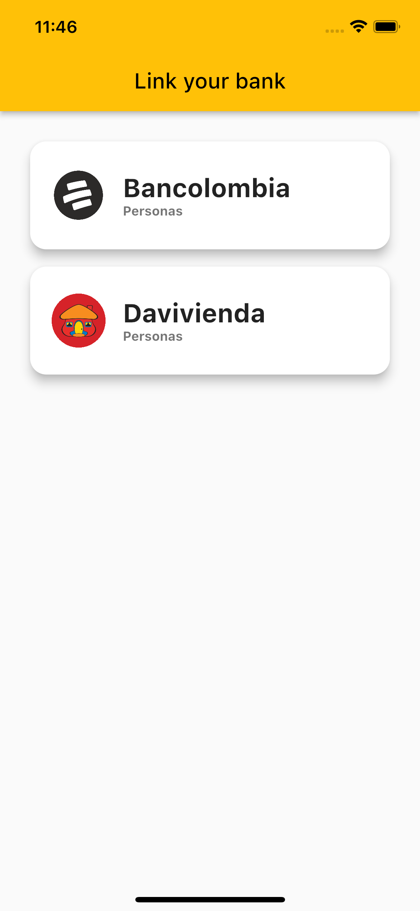
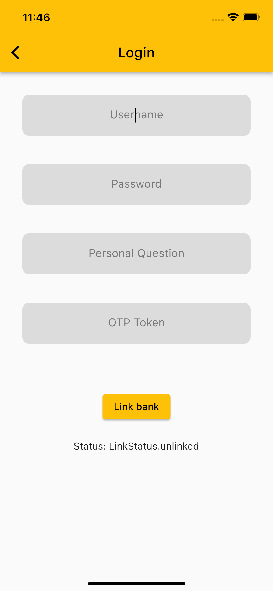
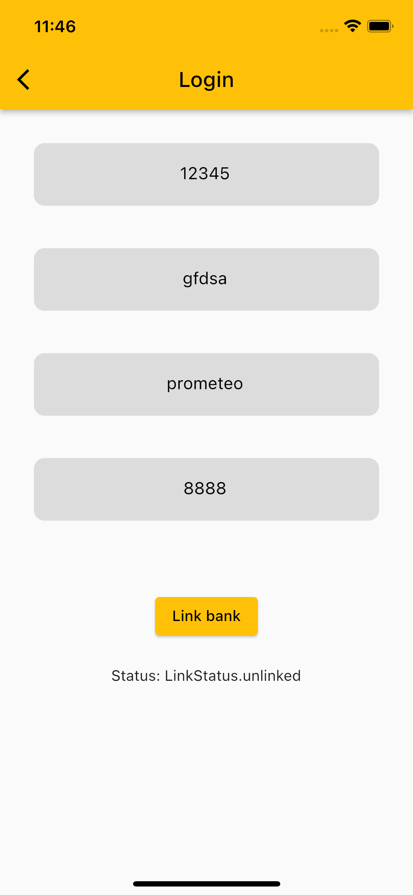
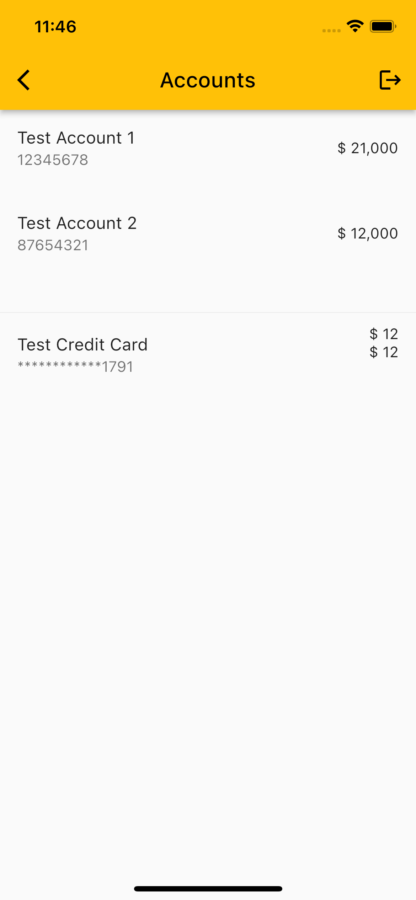
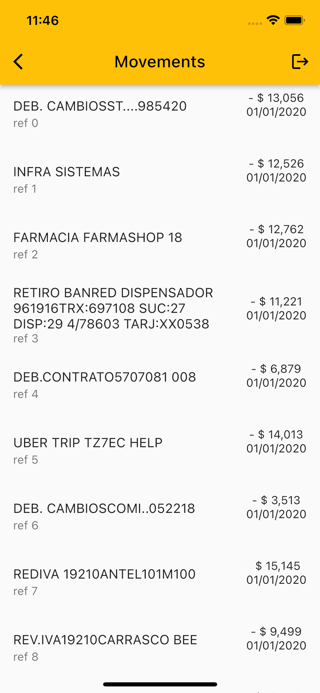

# sandbox_prometeo

This example app interacts with prometeo API to link an app to bank accounts in Latin America.

| Select Bank Screen.   | Login Screen (Bank Auth Fields)  | Login Screen (Filled form)  | 
| :-------------------- | :------------------------------- | :-------------------------- | 
|  |  |  | 

| User Bank Accounts Screen | Movements Screen.                |
| :------------------------ | :------------------------------- |
|  |  |

# About open banking

Around the world, Open Banking is rapidly transforming the way that financial institutions operate. It increases transparency and opens up to new product opportunities, with banks sharing information in a secure, standardized format to authorized organizations. With Fintech companies having been on the forefront of the Open Banking movement in the past, traditional institutions have begun to seize the opportunities created by Open Banking.

# sandbox_prometeo_api
